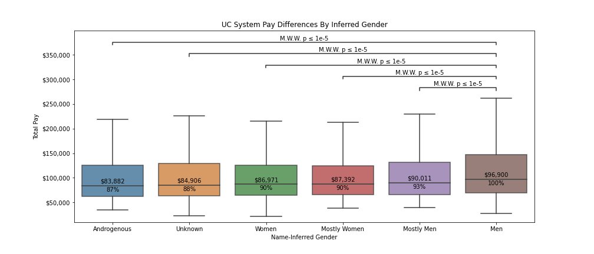

# Physician Statistics from Transparent California Data

# UC Physician Inferred Gender Pay Disparities
Using `gender_guesser`, gender was inferred using workers' first names. Obviously, this model relies on many assumptions and the gender groups will contain some of members from other groups. With this consideration, the model is still robust and the comparisons between gender groups are still statistically significant.

### Sources:
Thank you California for supporting public salary transparency.

https://transparentcalifornia.com/download/salaries/university-of-california/